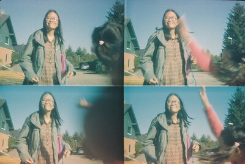
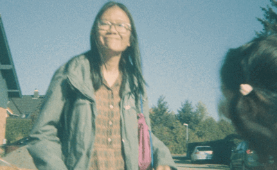

# Four Frames One Moment

A web app that converts Lomo Action Sampler photos into stabilized animated GIFs.

**Live at [4fram.es](https://4fram.es)**

 → 

## What it does

The Lomo Action Sampler camera captures 4 sequential photos in a 2x2 grid on a single frame. This app:

1. Splits the image into 4 quadrants
2. Aligns frames to reduce wobble (the 4 lenses aren't perfectly aligned)
3. Creates a smooth looping GIF animation

## Tech stack

- Node.js + Express
- ImageMagick for image processing
- Vanilla HTML/CSS/JS frontend
- Deployed on Dokku

## Running locally

```bash
npm install
npm start
```

Requires ImageMagick to be installed (`brew install imagemagick` on macOS).

## Frame order

The default frame order is: **TL → BL → BR → TR**

This matches the typical Lomo Action Sampler firing sequence.

## Deployment

Deployed via git push to Dokku:

```bash
git push dokku main
```

## License

MIT
